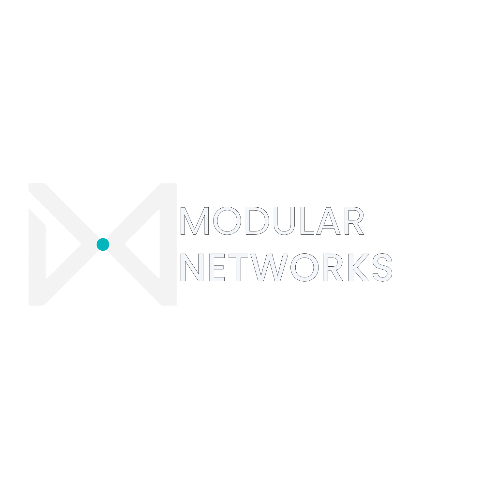

  

# Modular Networks

A collection of network designs built around real-world scenarios, focusing on segmentation, secure access control, and scalable architecture.

Each design reflects how networks evolve as environments grow — from simple guest access to multi-department infrastructures with layered security.

---

## Design Library

🔹 Guest Wi-Fi Segmentation  
  
Baseline guest network isolation

---

🔹 MoCo VLAN Segmentation  
  
Multi-VLAN architecture with controlled inter-VLAN routing

---

🔹 MoCo Family Center Network Design  
  
Multi-department network with ACL enforcement and physical port security

---

🔹 Ransomware Containment & Failover Design 🚨  
  
Detection, containment, and warm-site failover strategy for business continuity

---

🔹 Spark of Life Theatre Production 🎭  
  
Live event network with segmented access for guests, staff, IoT stage systems, and an isolated stage manager control network

---
🔹 MadX Games Gaming Expo Infrastructure 🎮  
  
Segmented esports convention infrastructure supporting tournament systems, guest Wi-Fi, vendor operations, VIP access, security coordination, and AV production environments

---

## Focus Areas

- VLAN segmentation across multi-department environments  
- Secure guest network design with enforced isolation  
- Inter-VLAN routing (router-on-a-stick, 802.1Q)  
- Access control using ACLs for traffic segmentation  
- Physical port security and access-layer protection  
- Scalable, real-world network architecture  

---

## Philosophy

Each design is built with a focus on:

- Clarity over complexity  
- Scalable architecture that grows with the environment  
- Security at both the logical and physical layers  
- Practical, real-world implementation over theory  

The goal is to design networks that don’t just function — but hold up under real-world conditions.

---

More designs will continue to build on this foundation as the Modular Networks environment expands.
